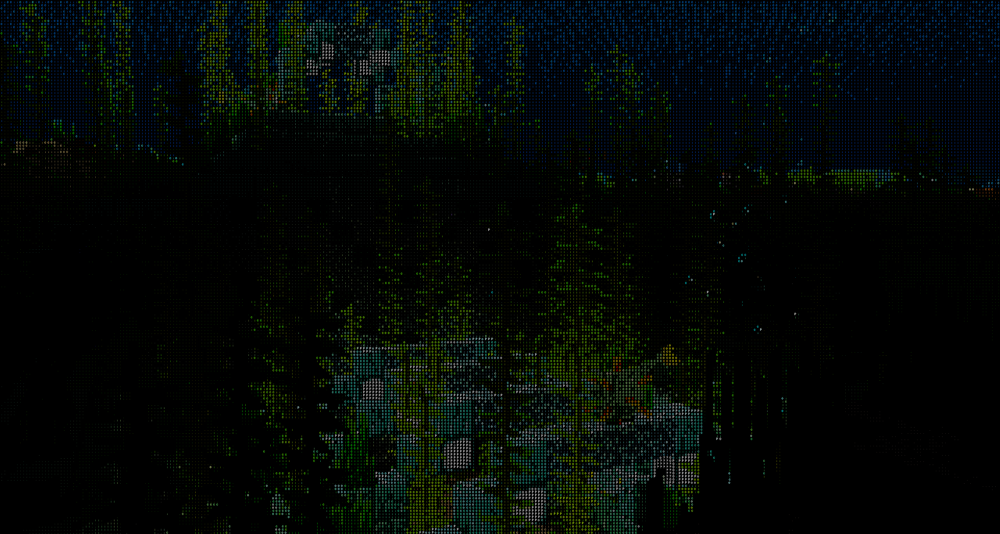
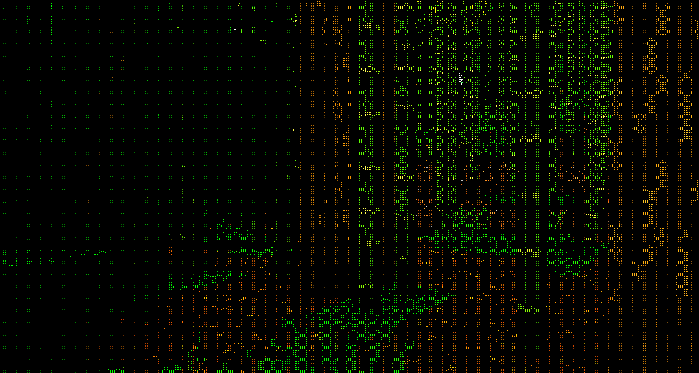
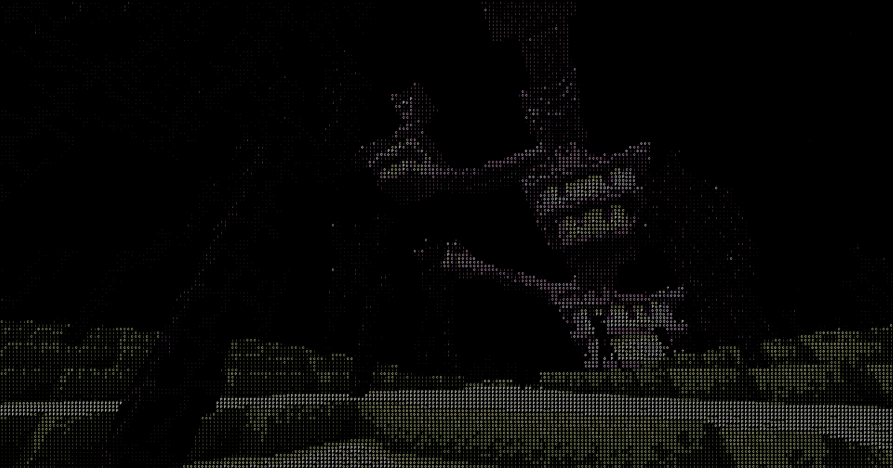
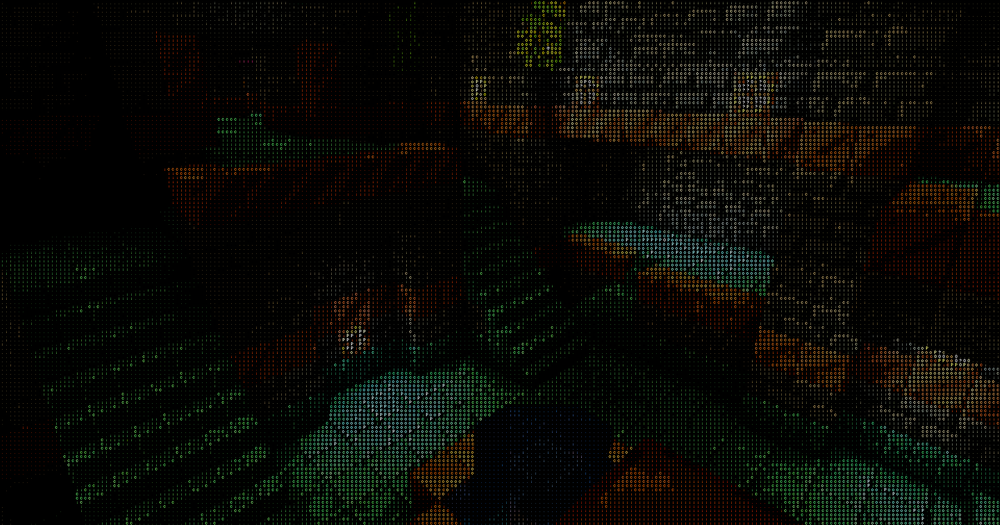
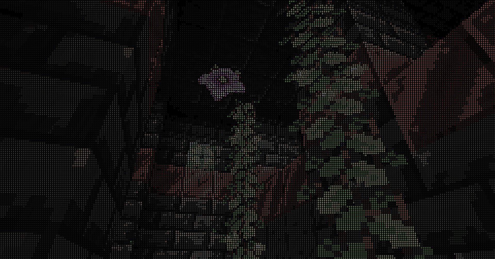
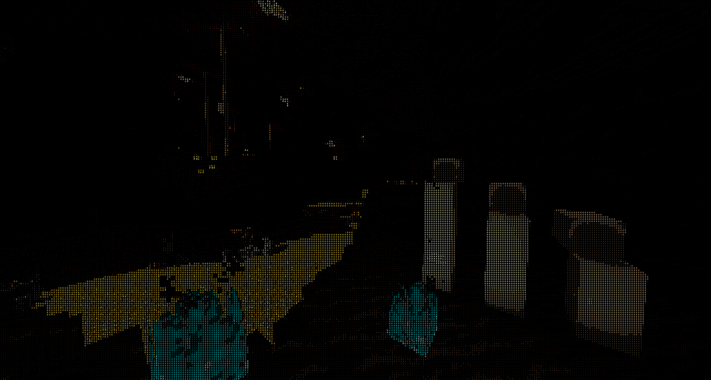
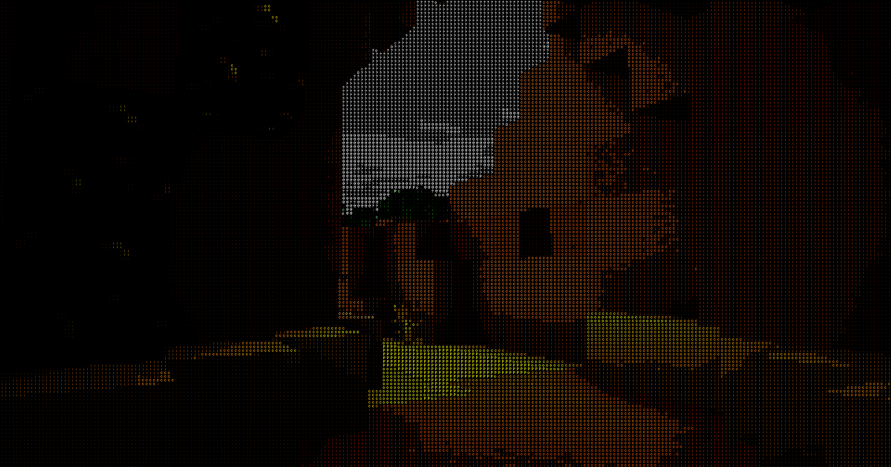
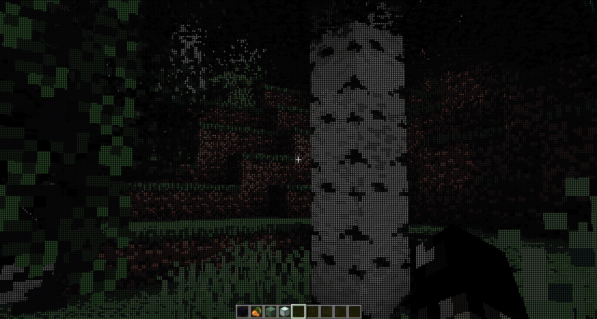

# MC_ASCII_Shader

This shader project focuses on brightness saturation control and clearness, allowing you to fine-tune the visual intensity of your scenes. The fog feature is currently under development and not fully functional, so it is omitted from this version.

The shader is best suited in darker,closed environments, but can also good alright outisde, as long as the sky doesn't take place on the screen.

Example Images

Credits to [5weetdev](https://www.curseforge.com/minecraft/shaders/ascii-like-shader-for-minecraft) for figuring out a simple way to render ASCIIs, but I do prefer my version of it, the color version is a bit neater.
